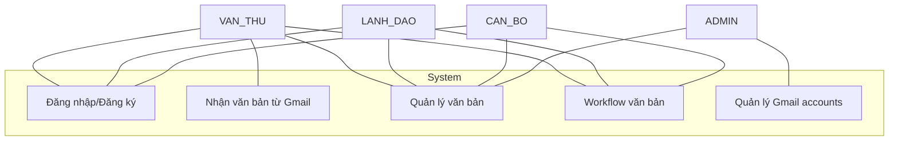
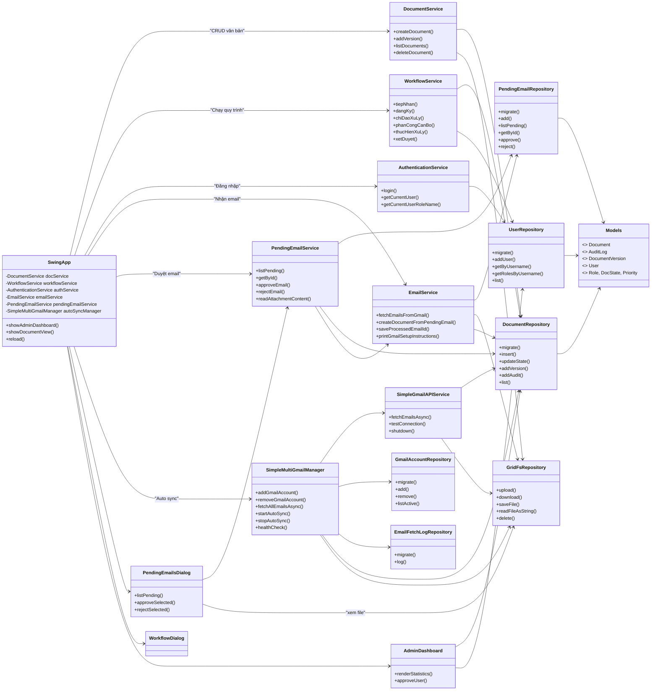
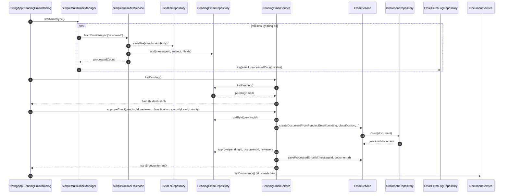

## UML (Mermaid)

### 1) Use Case Diagram


### 2) Class Diagram (cập nhật theo kiến trúc hiện tại)


### 3) Sequence - Từ auto-sync Gmail đến duyệt email tạo văn bản



### 4) ERD - Mô hình thực thể liên kết (2025)
```mermaid
erDiagram
    DOCUMENTS {
        BIGSERIAL id PK
        TEXT title
        TEXT latest_file_id FK
        TEXT state
        TEXT classification
        TEXT security_level
        INT doc_number
        INT doc_year
        TIMESTAMPTZ deadline
        TEXT assigned_to
        TEXT priority
        TEXT note
    }
    DOCUMENT_VERSIONS {
        BIGSERIAL id PK
        BIGINT document_id FK
        TEXT file_id
        INT version_no
        TIMESTAMPTZ created_at
    }
    AUDIT_LOGS {
        BIGSERIAL id PK
        BIGINT document_id FK
        TEXT action
        TEXT actor
        TIMESTAMPTZ at
        TEXT note
    }
    USERS {
        BIGSERIAL id PK
        TEXT username
        TEXT password_hash
        TEXT role
        TEXT position
        TEXT organization
        TEXT status
    }
    PENDING_EMAILS {
        BIGSERIAL id PK
        TEXT message_id UNIQUE
        TEXT subject
        TEXT from_email
        TIMESTAMPTZ received_at
        TEXT email_content
        TEXT[] attachment_file_ids
        TEXT status
        TEXT reviewed_by
        TIMESTAMPTZ reviewed_at
        BIGINT document_id FK
    }
    PROCESSED_EMAILS {
        BIGSERIAL id PK
        TEXT message_id UNIQUE
        BIGINT document_id FK
        TIMESTAMPTZ processed_at
    }
    GMAIL_ACCOUNTS {
        BIGSERIAL id PK
        TEXT email UNIQUE
        TEXT refresh_token
        TEXT access_token
        TIMESTAMPTZ token_expires_at
        BOOLEAN is_active
        TIMESTAMPTZ last_sync_at
        INT sync_interval_minutes
    }
    EMAIL_FETCH_LOGS {
        BIGSERIAL id PK
        BIGINT gmail_account_id FK
        TIMESTAMPTZ fetch_started_at
        TIMESTAMPTZ fetch_completed_at
        INT emails_processed
        TEXT status
        TEXT error_message
        TEXT query_used
    }
    EMAIL_PROCESSING_QUEUE {
        BIGSERIAL id PK
        BIGINT gmail_account_id FK
        TEXT message_id
        TEXT subject
        TEXT from_email
        TIMESTAMPTZ received_at
        TEXT status
        INT retry_count
        INT max_retries
        TEXT error_message
    }
    GMAIL_RATE_LIMITS {
        BIGSERIAL id PK
        BIGINT gmail_account_id FK
        TEXT quota_type
        BIGINT quota_limit
        BIGINT quota_used
        TIMESTAMPTZ quota_reset_at
    }
    WEBHOOK_NOTIFICATIONS {
        BIGSERIAL id PK
        BIGINT gmail_account_id FK
        TEXT notification_id
        TEXT topic_name
        TEXT subscription_id
        TIMESTAMPTZ expiration_time
        BOOLEAN is_active
    }
    GRIDFS_FILES {
        OBJECTID id PK
        STRING filename
        LONG length
        DATETIME uploadDate
        STRING contentType
    }
    GRIDFS_CHUNKS {
        OBJECTID id PK
        OBJECTID files_id FK
        INT n
        BINARY data
    }

    DOCUMENTS ||--o{ DOCUMENT_VERSIONS : "có phiên bản"
    DOCUMENTS ||--o{ AUDIT_LOGS : "ghi log"
    USERS ||--o{ AUDIT_LOGS : "thực hiện"
    DOCUMENTS ||--o{ PENDING_EMAILS : "tạo từ email" 
    DOCUMENTS ||--o{ PROCESSED_EMAILS : "đã map message"
    PENDING_EMAILS }o--|| DOCUMENTS : "link document_id"
    PROCESSED_EMAILS }o--|| DOCUMENTS : "FK document_id"
    DOCUMENTS }o--|| GRIDFS_FILES : "latest_file_id"
    PENDING_EMAILS }o--o{ GRIDFS_FILES : "attachment_file_ids"
    GRIDFS_FILES ||--o{ GRIDFS_CHUNKS : "chi tiết chunk"
    GMAIL_ACCOUNTS ||--o{ EMAIL_FETCH_LOGS : "lịch sử sync"
    GMAIL_ACCOUNTS ||--o{ EMAIL_PROCESSING_QUEUE : "hàng đợi"
    GMAIL_ACCOUNTS ||--o{ GMAIL_RATE_LIMITS : "quota"
    GMAIL_ACCOUNTS ||--o{ WEBHOOK_NOTIFICATIONS : "đăng ký"
```

**Ghi chú thiết kế**
- `pending_emails` giữ nguyên nội dung và danh sách file GridFS trước khi người dùng phê duyệt, đảm bảo không sinh document ngoài ý muốn.
- `processed_emails` lưu `message_id` để khóa trùng lặp giữa cả email đã duyệt và email đang pending.
- Nhóm bảng `gmail_*` phản ánh nhu cầu vận hành nhiều hộp thư: quản lý thông tin OAuth (`gmail_accounts`), quota (`gmail_rate_limits`), log đồng bộ (`email_fetch_logs`), hàng đợi xử lý (`email_processing_queue`) và webhook đẩy sự kiện (`webhook_notifications`).
- `documents.latest_file_id` cùng `document_versions.file_id` đều trỏ tới GridFS. Attachment của pending email cũng dùng GridFS thông qua danh sách `attachment_file_ids`.
- `audit_logs` liên kết tới `users.username` (logic ứng dụng) để phản ánh dấu vết trách nhiệm cho từng bước workflow.

### 5) Phân tích thiết kế hướng đối tượng (theo lý thuyết)

1. **Đóng gói (Encapsulation)**  
   - Mỗi *service* (DocumentService, WorkflowService, EmailService, PendingEmailService, SimpleMultiGmailManager) che giấu chi tiết truy cập dữ liệu và IO, phơi bày API thuần nghiệp vụ (createDocument, tiepNhan, approveEmail...).  
   - Các *repository* đảm nhiệm giao tiếp với nguồn dữ liệu cụ thể; GUI chỉ gọi qua service → tránh rò rỉ chi tiết kết nối (nguyên lý Information Hiding).

2. **Trách nhiệm đơn nhất (SRP)**  
   - DocumentService tập trung CRUD + version; WorkflowService chỉ xử lý chuyển trạng thái, kiểm tra vai trò; PendingEmailService chỉ lo vòng đời email đang chờ.  
   - Các dialog Swing giữ nhiệm vụ hiển thị và tương tác người dùng, không chứa logic dữ liệu.

3. **Trừu tượng hóa (Abstraction)**  
   - Domain model dùng record/enum (`Document`, `DocState`, `Role`, `Priority`) biểu diễn khái niệm nghiệp vụ thuần túy, tách khỏi hạ tầng.  
   - Các service hành xử như lớp trừu tượng của ca sử dụng: ví dụ WorkflowService mô tả quy trình văn bản đến bằng các phương thức tên nghiệp vụ.

4. **Tính mô-đun & phân lớp (Layering)**  
   - Lớp trình diễn (Swing GUI) ↔ lớp nghiệp vụ (services) ↔ lớp truy cập dữ liệu (repositories) ↔ cơ sở dữ liệu/GridFS.  
   - Mỗi lớp giao tiếp qua “hợp đồng” rõ ràng, giúp thay thế hoặc kiểm thử từng phần độc lập.

5. **Hợp thành & tổng hợp (Composition)**  
   - SwingApp hợp thành DocumentService, WorkflowService, EmailService... thể hiện phối hợp đối tượng để hoàn thiện chức năng tổng thể.  
   - SimpleMultiGmailManager quản lý tập hợp SimpleGmailAPIService theo Map, biểu diễn mối quan hệ “có” giữa manager và các connector Gmail.

6. **Quản lý trạng thái và vòng đời đối tượng**  
   - `DocState` phản ánh State Machine của Document; WorkflowService đảm nhận chuyển trạng thái hợp lệ, tránh thay đổi trực tiếp từ GUI.  
   - `PendingEmail` và `ProcessedEmail` biểu diễn hai pha vòng đời email: “đang chờ phê duyệt” và “đã gắn vào Document”.

7. **Phân quyền và vai trò**  
   - Role enum + UserRepository cung cấp mô hình actor; WorkflowService yêu cầu role cụ thể trước khi thực thi hành động, minh họa nguyên tắc kiểm soát truy cập dựa trên đối tượng.

8. **Mở rộng (Extensibility)**  
   - Có thể thêm service mới (NotificationService, ReportingService) mà không ảnh hưởng domain classes, vì các lớp đã tuân thủ ranh giới trách nhiệm.  
   - Repository độc lập giúp thay đổi nguồn dữ liệu (ví dụ sang ORM) mà không cần chỉnh GUI/service.

Phân tích trên nhấn mạnh các khái niệm hướng đối tượng cốt lõi (đóng gói, trừu tượng hóa, trách nhiệm, trạng thái, quan hệ giữa lớp) mà không đi sâu vào kỹ thuật triển khai cụ thể.

